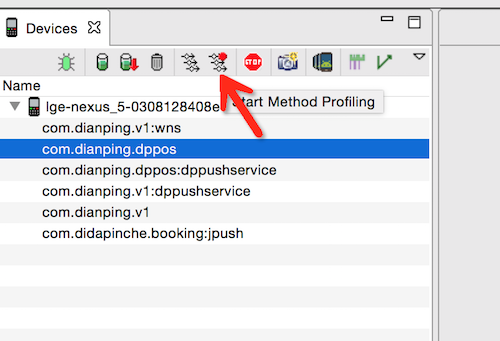
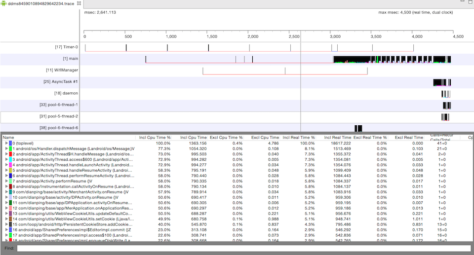
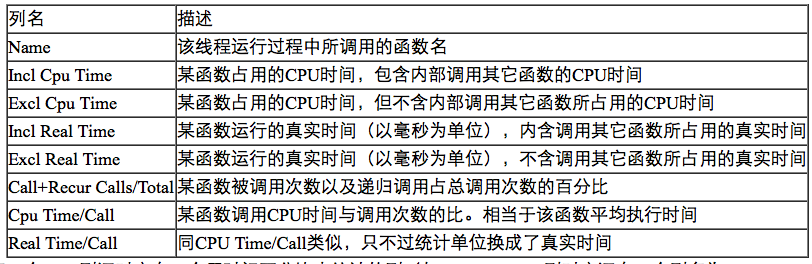
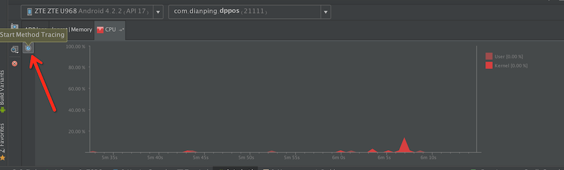
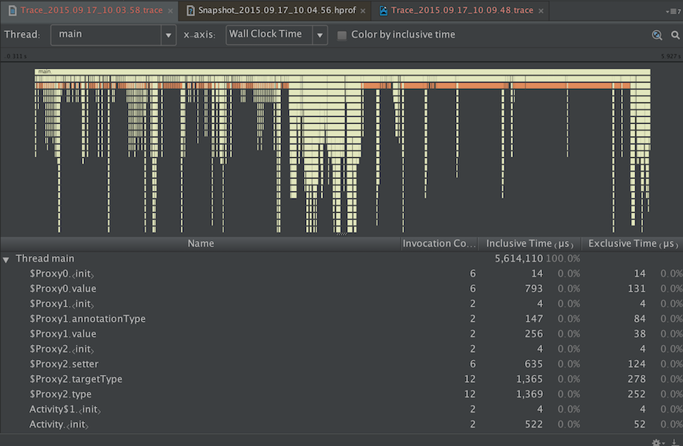
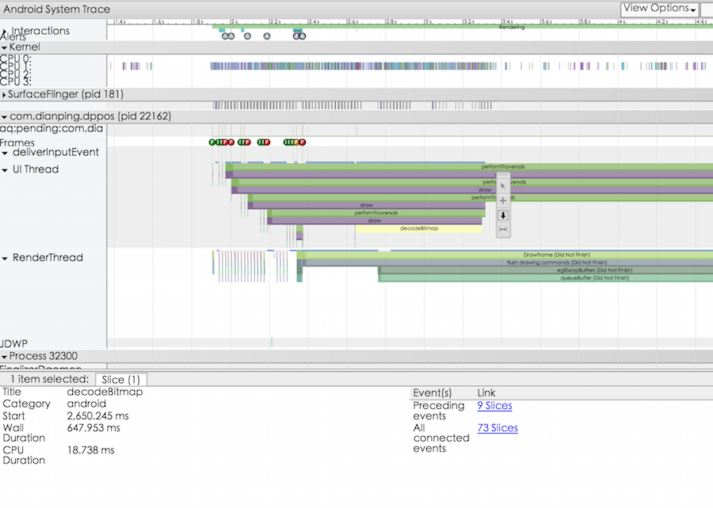

# Android性能分析方法简介

下面介绍几种分析Android App性能的方法。主要从时间维度分析App运行中比较耗时的操作。


##	1. 系统自带时间戳
	 
Android 系统中ActivityManager会默认打印启动activity相关的信息，其中带有Displayed的会统计启动消耗时间。

```
adb logcat |grep Displayed
```


```java
I/ActivityManager(  725): Displayed com.dianping.dppos/com.dianping.merchant.main.activity.app.SplashScreenActivity: +2s87ms
I/ActivityManager(  725): Displayed com.dianping.dppos/com.dianping.merchant.main.activity.app.LaunchActivity: +591ms

```

		

	
	
##	2. Traceview

### ddms
打开DDMS，选中"Start Method Profiling"，操作App需要分析性能的部分（时间最好控制在5s以内，方便分析），选中"Stop Method Profiling"。



DDMS 会自动保存为trace文件并打开。



下面看下这个表格的几个参数的含义



1. 看参数按照CPU Time/Call排序，可以找到耗时方法。
2. 按照Call+Recur Calls/Total排序，看频繁被调用的方法。

### Android Studio
在android studio中android tab选择CPU有一个时间按钮，可以跟ddms中的类似，点击开始方法分析，再点击停止分析，并且显示抓取数据。



抓取数据分析图如下：



根据方法执行时间排序或者上面时间轴图分析耗时操作。


## 3. Dmtracedump

dmtracedump 可以把前面生成的trace文件生成图片或html文件更具可读性。

```
dmtracedump [-ho] [-s sortable] [-d trace-base-name] [-g outfile] <trace-base-name>
```


```
Option						Description
-d <trace-base-name>		Diff with this trace name
-g <outfile>				Generate output to <outfile>
-h							Turn on HTML output
-o							Dump the trace file instead of profiling
-d <trace-base-name>		URL base to the location of the sortable javascript file
-t <percent>				Minimum threshold for including child nodes in the graph (child's inclusive time as a percentage of parent inclusive time). If this option is not used, the default threshold is 20%.
```

### 生成方法树图片

```
dmtracedump -g method.png ddms.trace
```

ps. 生成图片需要安装Graphviz

### 生成html文件

```
dmtracedump -h  ddms.trace > trace.html
```

##	4. Systrace

Systrace 是 Android 4.1 中新增的性能数据采样和分析工具。它可帮助开发者收集 Android 关键子系统（如 surfaceflinger、WindowManagerService 等 Framework 部分关键模块、服务，View 系统等）的运行信息，从而帮助开发者更直观的分析系统瓶颈，改进性能。

systrace 命令格式

```
$ python systrace.py [options] [category1] [category2] ... [categoryN]
```

参数：

```
Option					Description
-h, --help				Show the help message.
-o <FILE>				Write the HTML trace report to the specified file.
-t N, --time=N			Trace activity for N seconds. The default value is 5 seconds.
-b N, --buf-size=N		Use a trace buffer size of N kilobytes. This option lets you limit the total size of the data collected during a trace.
-k <KFUNCS>
--ktrace=<KFUNCS>		Trace the activity of specific kernel functions, specified in a comma-separated list.
-l, --list-categories	List the available tracing category tags. The available tags are:
						gfx - Graphics
						input - Input
						view - View
						...
-a <APP_NAME>
--app=<APP_NAME>		Enable tracing for applications, specified as a comma-separated list of package names. The apps must contain tracing instrumentation calls from the Trace class. For more information, see Analyzing UI Performance with Systrace.
--from-file=<FROM_FILE>	Create the interactive Systrace report from a file, instead of running a live trace.
-e <DEVICE_SERIAL>
--serial=<DEVICE_SERIAL>Conduct the trace on a specific connected device, identified by its device serial number.

```

实例：

```
$ cd android-sdk/platform-tools/systrace
$ python systrace.py --time=10 -o mynewtrace.html sched gfx view wm
```

用chrome打开mynewtrace.html文件




点开右上角的Alerts，有工具根据trace文件分析出来的问题点以及解决方案建议。

chrome 中操作快捷键

```
Key	Description
w			Zoom into the trace timeline.
s			Zoom out of the trace timeline.
a			Pan left on the trace timeline.
d			Pan right on the trace timeline.
e			Center the trace timeline on the current mouse location.
g			Show grid at the start of the currently selected task.
Shift+g	Show grid at the end of the currently selected task.
Right Arrow	Select the next event on the currently selected timeline.
Left Arrow	Select the previous event on the currently selected timeline.
```


也可以在关心的代码中加入Trace，精确定位问题。

```
public void ProcessPeople() {
    Trace.beginSection("ProcessPeople");
    try {
        Trace.beginSection("Processing Jane");
        try {
            // code for Jane task...
        } finally {
            Trace.endSection(); // ends "Processing Jane"
        }

        Trace.beginSection("Processing John");
        try {
            // code for John task...
        } finally {
            Trace.endSection(); // ends "Processing John"
        }
    } finally {
        Trace.endSection(); // ends "ProcessPeople"
    }
}

```


## 参考


[http://blog.csdn.net/innost/article/details/9008691](http://blog.csdn.net/innost/article/details/9008691)  

[http://blog.gaoyuan.xyz/2013/11/22/android-app-profile-tools/](http://blog.gaoyuan.xyz/2013/11/22/android-app-profile-tools/)

[https://developer.android.com/tools/help/systrace.html](https://developer.android.com/tools/help/systrace.html)

[http://developer.android.com/intl/zh-cn/tools/debugging/debugging-tracing.html](http://developer.android.com/intl/zh-cn/tools/debugging/debugging-tracing.html)


